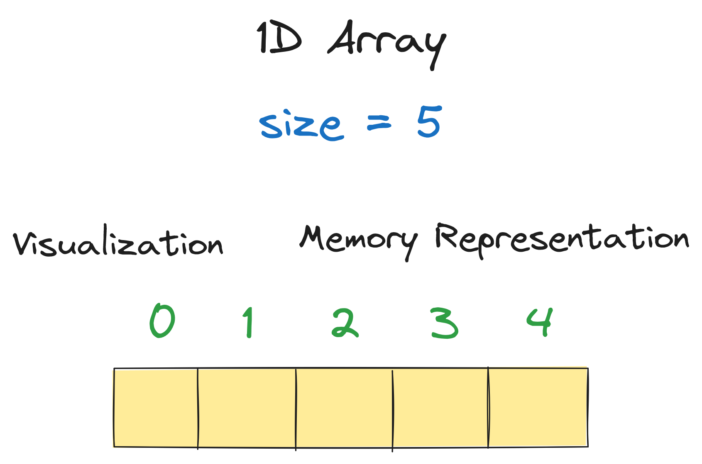
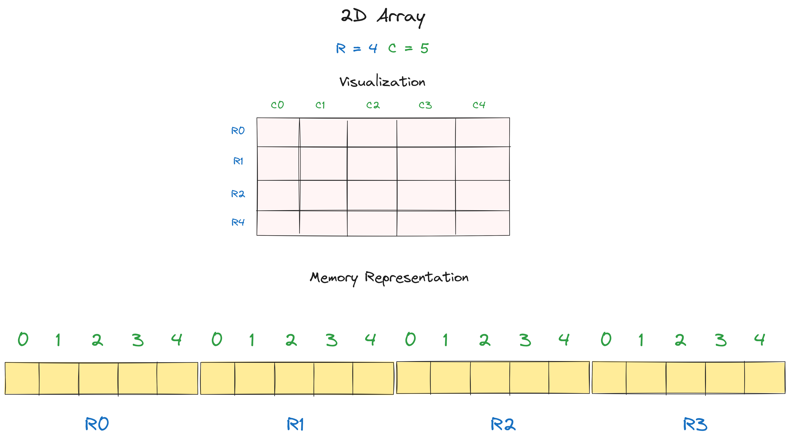
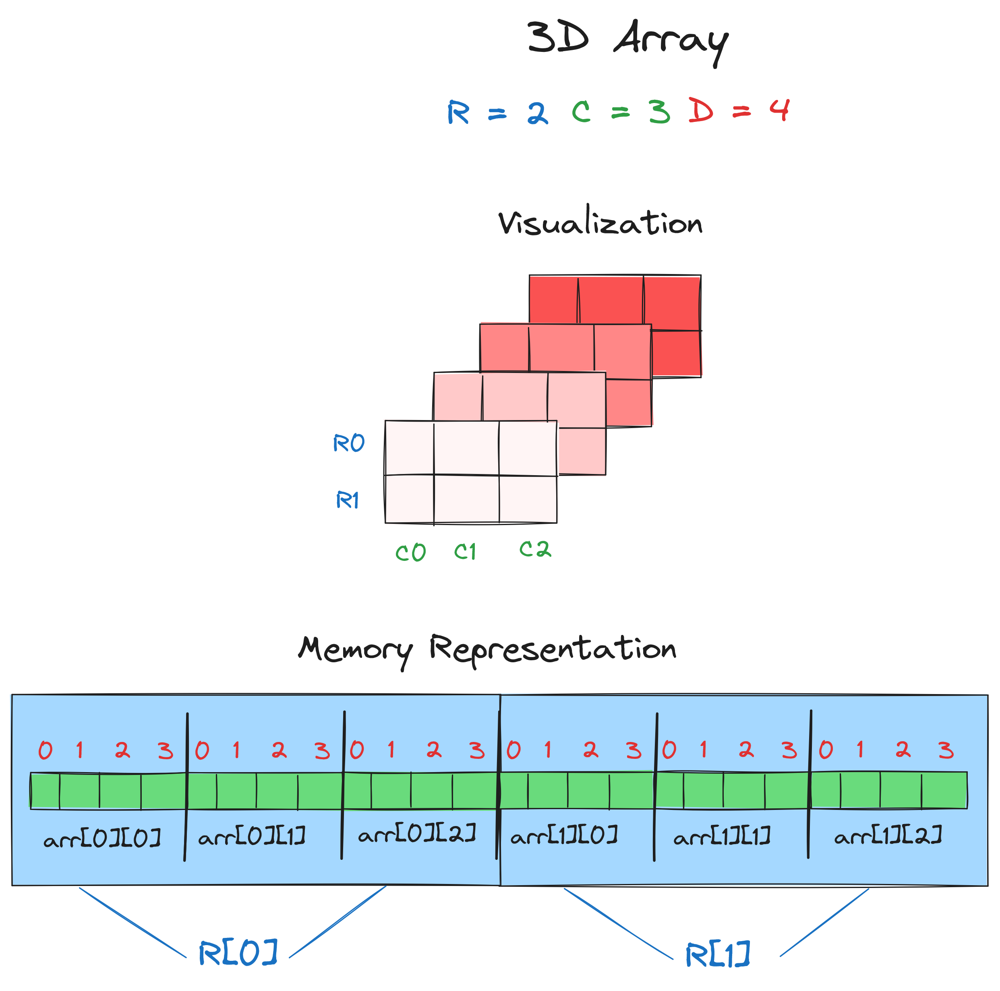

# Array Data Structure

An array is a fundamental data structure that stores a collection of elements, where each element is identified by at least one array index or key. Arrays are commonly used for organizing data and facilitating efficient access and manipulation.

Arrays are:

- collection of items stored at contiguous memory locations.
- in some programming languages, arrays only store values of the same type and their length has to be defined at the time of creation.

## Overview

Arrays can be categorized based on their dimensions:

- **Single-Dimensional Array**: A linear collection of elements accessed using a single index.
- **Multi-Dimensional Array**: An array of arrays, forming a matrix-like structure, accessed using multiple indices.

## Visualizations

### 1D



### 2D



### 3D



## Operations

The following table describes common operations on arrays along with their time complexities:

| Operation                             | Description                                      | Time Complexity                 |
| ------------------------------------- | ------------------------------------------------ | ------------------------------- |
| Accessing Elements (`array[i]`)       | Accessing an element by index                    | O(1)                            |
| Pushing Elements (`array.push()`)     | Adding an element to the end of the array        | O(1) amortized, O(n) worst case |
| Popping Elements (`array.pop()`)      | Removing the last element from the array         | O(1) amortized, O(n) worst case |
| Inserting Elements (`array.splice()`) | Inserting elements at arbitrary positions        | O(n)                            |
| Deleting Elements (`array.splice()`)  | Deleting elements from arbitrary positions       | O(n)                            |
| Searching for an Element              | Finding the index of an element (unsorted array) | O(n)                            |
|                                       | Finding the index of an element (sorted array)   | O(log n)                        |

## Representation

Arrays are typically represented in memory as contiguous blocks of memory. The memory representation depends on the programming language and the underlying system architecture.

## Example Code (in TypeScript)

```typescript
// Single-Dimensional Array
let array1D: number[] = [1, 2, 3, 4, 5];

// Two-Dimensional Array
let array2D: number[][] = [
  [1, 2, 3],
  [4, 5, 6],
  [7, 8, 9],
];

// Three-Dimensional Array
let array3D: number[][][] = [
  [
    [1, 2],
    [3, 4],
  ],
  [
    [5, 6],
    [7, 8],
  ],
];
```

## Accessing Equations

### Single-Dimensional Array (1D)

Given:

- `h`: Address of the first element
- `c`: Element size in memory
- `i`: Index of the desired element

Accessing equation: `h + (i * c)`

### Two-Dimensional Array (2D)

Given:

- `h`: Address of the first element
- `c`: Element size in memory
- `i`, `j`: Indices of the desired element
- `m`, `n`: Dimensions of the array

Accessing equation: `h + ((i * n + j) * c)`

### Three-Dimensional Array (3D)

Given:

- `h`: Address of the first element
- `c`: Element size in memory
- `i`, `j`, `k`: Indices of the desired element
- `x`, `y`, `z`: Dimensions of the array

Accessing equation: `h + (((i * z + j) * y + k) * c)`

## References

- [Code Masry - Array Data Structure](https://youtu.be/ALs4QeZ495Y?si=hwH-X2kPaJ0q0vIc).
- [Code Masry - Multi Dimension Array Data Structure](https://youtu.be/A_CQhz8xsQg?si=sSUTkVUHTuRtp-x2).
- [Code Masry - Three Dimension Array Data Structure](https://youtu.be/wubHiW8Vhds?si=lTEv68lqr5F5ya_u).
