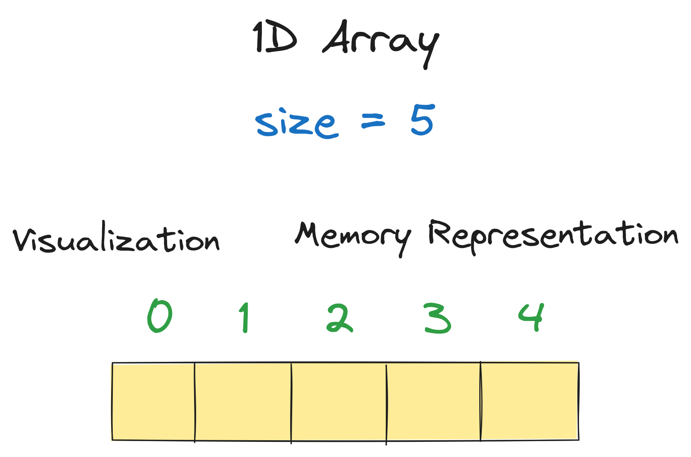
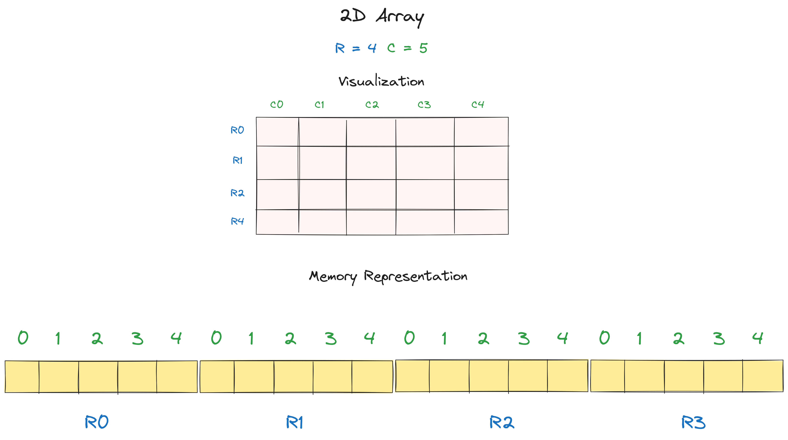
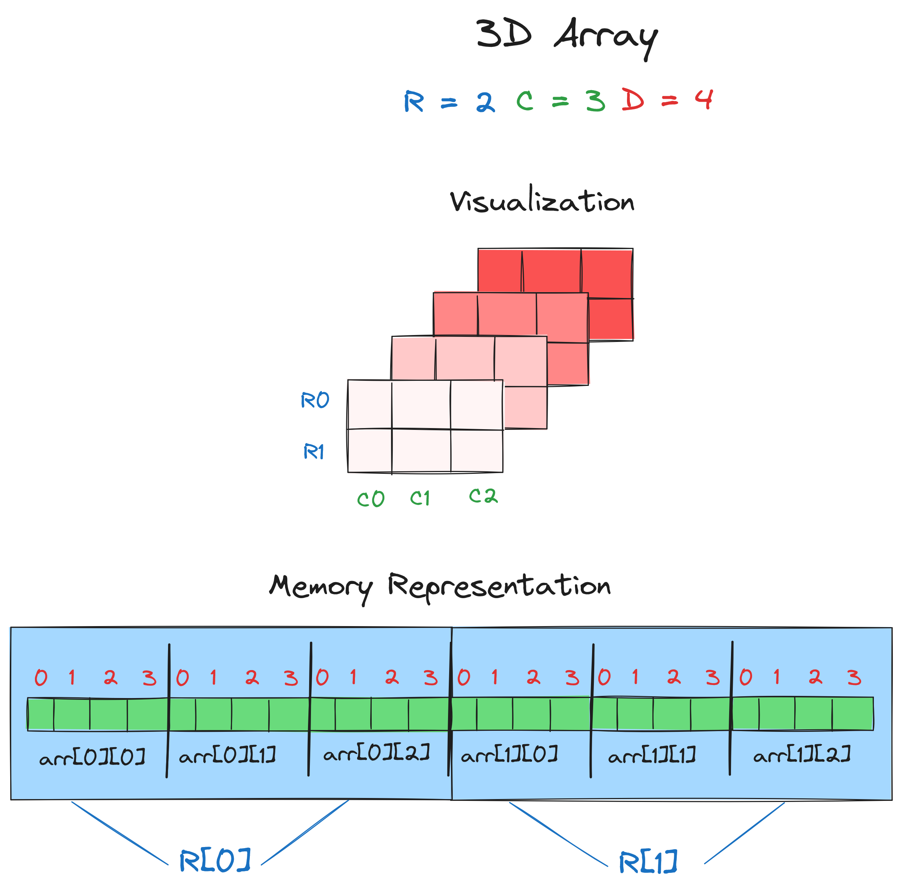

# Array Data Structure

An array is a fundamental data structure that stores a collection of elements, where each element is identified by at least one array index or key. Arrays are commonly used for organizing data and facilitating efficient access and manipulation.

## Overview

Arrays can be categorized based on their dimensions:

- **Single-Dimensional Array**: A linear collection of elements accessed using a single index.
- **Multi-Dimensional Array**: An array of arrays, forming a matrix-like structure, accessed using multiple indices.

## Visualizations

### 1D



### 2D



### 3D



## Operations

The following table describes common operations on arrays along with their time complexities:

| Operation                             | Description                                      | Time Complexity                 |
| ------------------------------------- | ------------------------------------------------ | ------------------------------- |
| Accessing Elements (`array[i]`)       | Accessing an element by index                    | O(1)                            |
| Pushing Elements (`array.push()`)     | Adding an element to the end of the array        | O(1) amortized, O(n) worst case |
| Popping Elements (`array.pop()`)      | Removing the last element from the array         | O(1) amortized, O(n) worst case |
| Inserting Elements (`array.splice()`) | Inserting elements at arbitrary positions        | O(n)                            |
| Deleting Elements (`array.splice()`)  | Deleting elements from arbitrary positions       | O(n)                            |
| Searching for an Element              | Finding the index of an element (unsorted array) | O(n)                            |
|                                       | Finding the index of an element (sorted array)   | O(log n)                        |

## Representation

Arrays are typically represented in memory as contiguous blocks of memory. The memory representation depends on the programming language and the underlying system architecture.

[//]: # "Insert images illustrating array representation in memory here"

## Example Code (in TypeScript)

```typescript
// Single-Dimensional Array
let array1D: number[] = [1, 2, 3, 4, 5];

// Two-Dimensional Array
let array2D: number[][] = [
  [1, 2, 3],
  [4, 5, 6],
  [7, 8, 9],
];

// Three-Dimensional Array
let array3D: number[][][] = [
  [
    [1, 2],
    [3, 4],
  ],
  [
    [5, 6],
    [7, 8],
  ],
];
```

## Accessing Equations

### Single-Dimensional Array (1D)

Given:

- `h`: Address of the first element
- `c`: Element size in memory
- `i`: Index of the desired element

Accessing equation: `h + (i * c)`

### Two-Dimensional Array (2D)

Given:

- `h`: Address of the first element
- `c`: Element size in memory
- `i`, `j`: Indices of the desired element
- `m`, `n`: Dimensions of the array

Accessing equation: `h + ((i * n + j) * c)`

### Three-Dimensional Array (3D)

Given:

- `h`: Address of the first element
- `c`: Element size in memory
- `i`, `j`, `k`: Indices of the desired element
- `x`, `y`, `z`: Dimensions of the array

Accessing equation: `h + (((i * z + j) * y + k) * c)`

## References

- [Code Masry - Array Data Structure](https://youtu.be/ALs4QeZ495Y?si=hwH-X2kPaJ0q0vIc).
- [Code Masry - Multi Dimension Array Data Structure](https://youtu.be/A_CQhz8xsQg?si=sSUTkVUHTuRtp-x2).
- [Code Masry - Three Dimension Array Data Structure](https://youtu.be/wubHiW8Vhds?si=lTEv68lqr5F5ya_u).
